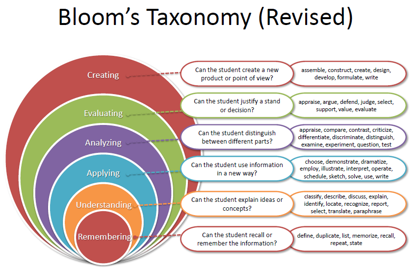
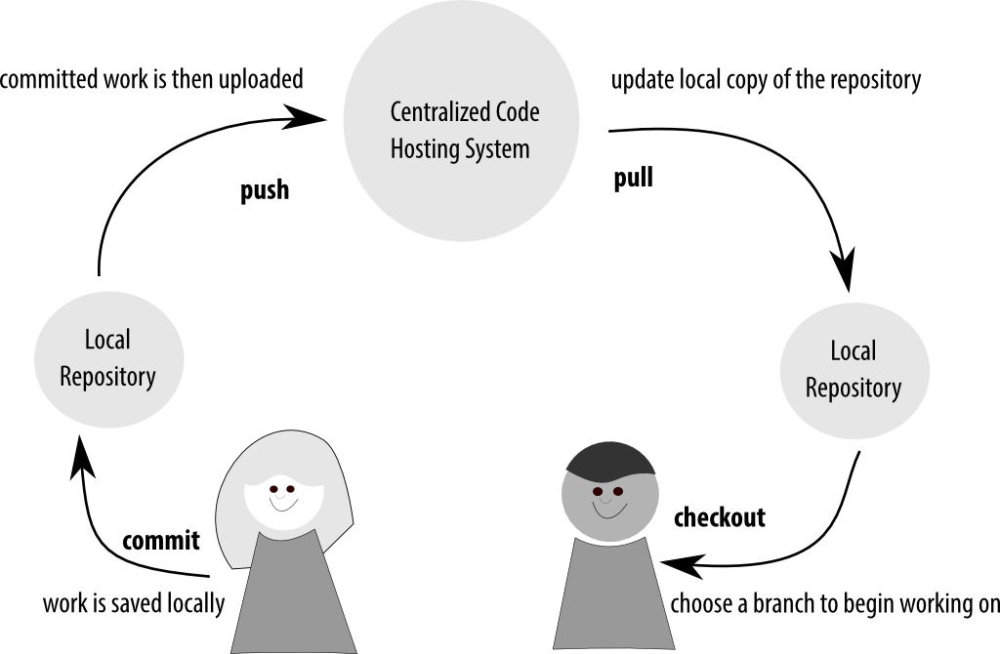

# Git Makes Me Angry Inside
## Adventure Mapping for Git

Emma Jane Hogbin Westby

@emmajanehw

www.gitforteams.com


----
# "I've tried to learn this stuff and I just can't."


## How we typically teach people Git has nothing to do with adult education best practices.


# Adults learn best when they can be selfish.


# That means the classroom must relate to an actual problem.


# "My tech lead said I need to memorise all the Git commands."


## (obligatory rant on
# "learning styles"
## typically goes here)


# Git
## The Game of Chance

1. Character development.
2. Adventure map.
3. Town planning.
4. Interior design.


# Warning:<br>Analogies may be flawed.


# Agenda

Four techniques to understanding the context of what's happening in Git.

1. Describe the work your team does.
2. Map your network of repositories.
3. Diagram your branching strategy.
4. Defend what gets stored in the repo.





----
# Activity 1:
# Character Sheet


## Git is weird and hard because <br/>the internals have strong opinions, <br />but the interface does not.


# Let's create some arbitrary constraints.


# Staring ... YOU!


## Who's on your code team?

Write down a list of the NAMES of all the people on your code team.

- UX researchers
- developers
- designers
- project managers
- clients
- ???


# Where do you fit in?

Write a list of all the (code-related) tasks you are responsible for.

- Writing code.
- Reviewing designs.
- Fixing broken code.


## What's your workflow?

Create a linear assembly line that plots the order of tasks

and people who are involved.


### A Simple Workflow
Shared repository with two contributors.




### A Restricted Access Workflow
Contributor does not have commit access to the main repository.


## Character Sheet: Summary
### Set political constraints for your players.

- Know who the characters are in your game of Git.
- Write down the actions they are allowed to take in the game.
- Plot a timeline of actions for each character.
  (This may turn into a decision tree.)


----
# Activity 2:
# Adventure Map


# Repositories Are
### (sort of)
# Like Towns


## Using your assembly line as a reference, sketch the map of where your towns exist.


# Who works in each of those towns?

Are you allowed to "push" commits to each of those repositories?


# What are the major transit links between these towns?

Is it an automated gatekeeper?

Do I need to manually push/pull my cart between the towns?


## Adventure Map: Summary
### Sketch the __landscape__ you are going to play in.

- Draw a map of all the places where repositories are found.
- Identify on your map who controls each of these "towns".
- Identify the major routes between repositories.
- Illustrations should look like a network diagram. 


----
# Activity 3:
# Town Planning


### Branches are used to link individual commits.

Let's call _branches_ which link _commits_

the _streets_ which provide access to _individual buildings_.


# __Popular Conventions__
## Are you building a farming grid,
### or 
## encircling a castle with a ring road?


## The __master branch__ is like
# the high street
## ... every town repository has one. 


## Popular Branching Conventions

- State / Environment Branching (GitLab Flow)
- Branch-Per-Feature (GitHub Flow)
- Scheduled Release (GitFlow)


### Environment Branches (GitLab Flow)


### Branch-Per-Feature (GitHub Flow)


### Scheduled Release (GitFlow)


### Within your table, discuss which branching strategy sounds most effective for your characters.

- Environment branches 
- Branch-per-feature
- Scheduled release


### Draw the "swim lanes" (ball-and-chain graph) for how one new piece of work would be incorporated into your repository.

(this requires a BIG cognitive jump; I will help you)


## Town Planning: Summary
### Use one convention to build your roads.

- The strategy you use to separate work is entirely dependent on the type of work you are doing.
- Don't pick a convention because it's popular. Pick it because it allows your characters to achieve their goals with less friction.
- Diagrams should mimic the graphed output of `git log --graph`. 


----
# Activity 4:
# Interior Design

What do you actually put in a repository?


## Include only what you need.


## The Hard Questions

- How do you manage dependencies?
- Where do you store very large files?
- How do optimise your build process for very fast deployments?


## Outsource your
## dependency management

Version your build manifest

ignore the built files.


## If you must include external work

- Keep your "core" clean and track upstream work with named branches.
- Nest repositories without tracking by using subtrees (clone inside a clone).
- Git can track external repositories with submodules. There be dragons.


## Store as much as you need, <br />but not more.


## Monolith: one mega repo

Easier:

- see the scope of a single repository.
- track all dependent files from a single location.
- adjust architecture decisions "on the fly".
- deploy all related code.


## Microservices: many ickle repos

Easier:

- ship updates without waiting for other teams.
- independent systems with machine relationships (fewer points of system-wide failure).
- faster downloads of only relevant information.


## Tangent: Git vs. Perforce

Git: we tend to store *only* deployment files.

Perforce: we tend to store *all* project files.


# Storing Binary Files

Deployment binaries?

Project assets? 


### Tip: Use off-site storage for very large files

Do not version binaries in the repository;

reference them from another location.

- [git-annex](https://git-annex.branchable.com/)
- [git-bigfiles](http://caca.zoy.org/wiki/git-bigfiles)
- [GLFS](https://git-lfs.github.com) * new shiny!

Note: Best Practice. http://blogs.atlassian.com/2014/05/handle-big-repositories-git/


### Tip: Use shallow clones for faster deployments

Avoid grabbing all versions of a file for the deployment.

````
$ git clone --depth [depth] [remote-url]
````

````
$ git clone [URL] --branch [branch_name] \
  --single-branch [folder]
````


## Interior Design: Summary
### Include only what you need.

- Consider the people and processes you are optimising for.
- If necessary, use off-site storage for very large files.
- There are ways to limit what is downloaded on clone, 
  so don't be afraid to insist all files be included in the repository.


----
Best Practices
### Understanding How Your Team Uses Git

- Set political constraints for your players. (Access control.)
- Sketch the landscape you are going to play in. (Remote repositories.)
- Use one convention to build your roads. (Branches.)
- Include only what you need in each building. (Commits.)


## Git: The Game of Chance

https://github.com/gitforteams/game-of-chance


## gitforteams.com

Emma Jane Hogbin Westby

@emmajanehw

[emmajane.github.io/git-adventure-mapping](http://emmajane.github.io/git-adventure-mapping)

[](http://shop.oreilly.com/product/0636920034520.do?cmp=af-prog-books-videos-product_cj_auwidget670_0636920034520_4470479)
[](http://shop.oreilly.com/product/0636920034872.do?cmp=af-prog-books-videos-product_cj_auwidget671_0636920034872_4470479)


-----------
# Resources
<!-- .slide: data-background="#fff9f9" -->


## Big Repositories
<!-- .slide: data-background="#fff9f9" -->

- [How to Handle Big Repositories with Git](https://www.atlassian.com/git/articles/how-to-handle-big-repositories-with-git/)
- [HackerNews: How do you handle your microservices](https://news.ycombinator.com/item?id=9705098)
- [StackExchange: How do you handle external dependencies?](http://programmers.stackexchange.com/questions/110093/how-would-one-handle-external-dependencies-in-an-open-source-project)
- [Organizing Microservices in a Single Repository](http://blog.plataformatec.com.br/2015/01/organizing-microservices-in-a-single-git-repository/)


## Dependency Management
<!-- .slide: data-background="#fff9f9" -->

- [Paket for .NET and Mono](http://fsprojects.github.io/Paket/)
- [Composer for PHP](https://getcomposer.org/doc/00-intro.md)


## Submodules
<!-- .slide: data-background="#fff9f9" -->

- [Mastering Submodules](https://medium.com/@porteneuve/mastering-git-submodules-34c65e940407)
